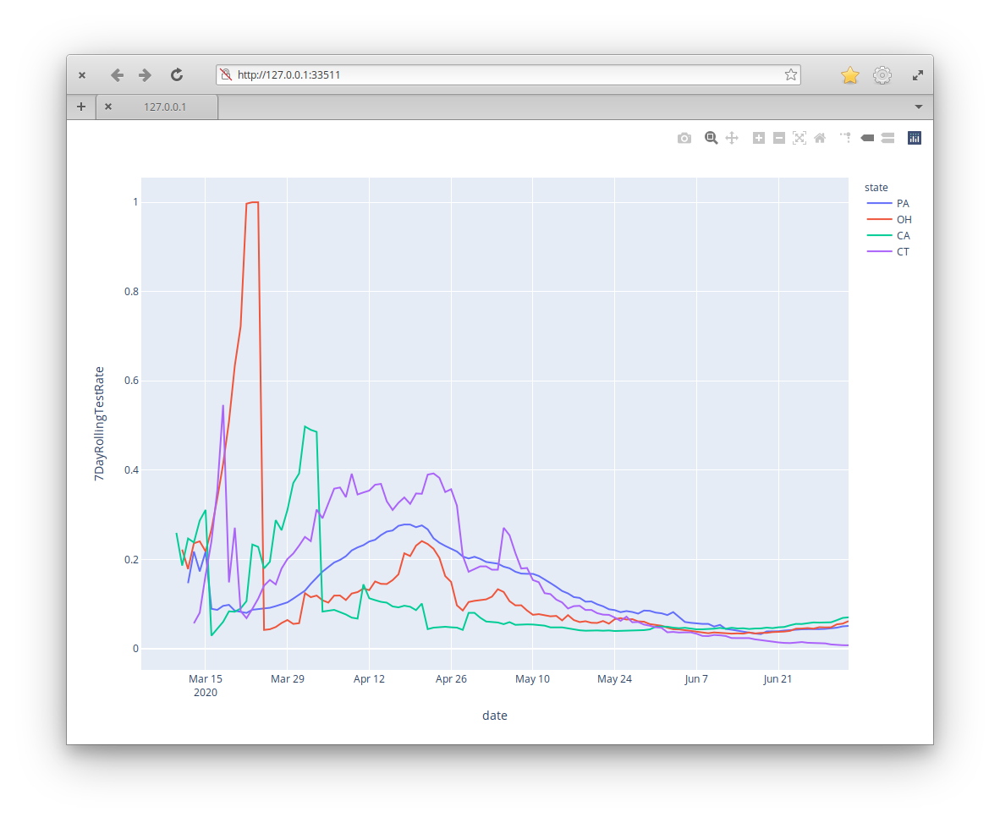

# covid-testing

Plot COVID test rates by state. 

# Data

Data is generously provided by [The COVID Tracking Project](https://covidtracking.com/). I would really love to have county-level data, so if you know of such a source please let me know. 

# Set up

Ubuntu
---

```bash
# install virtual env wrapper
# you will need to open a new shell to get updated environment variables after installing
sudo apt install virtualenvwrapper python3.7

# make a virtual environment
mkvirtualenv covid-testing -p python3.7

# install requirements (in project dir)
pip instally -R requirements.txt

```
# Usage

```bash
./plot_stuff.py PA OH CA CT --window=7

```



