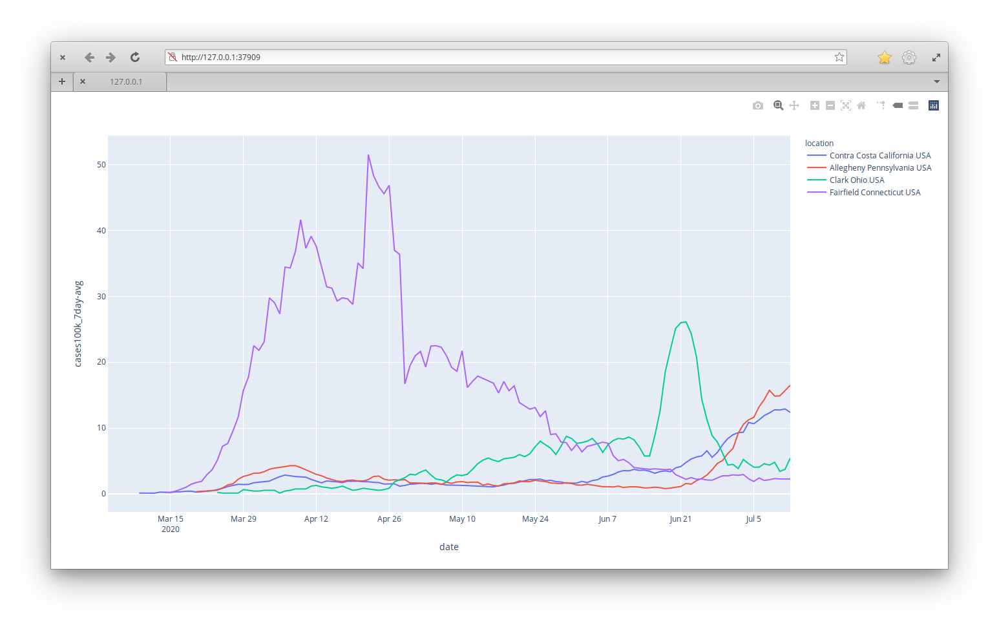

# covid-testing

Plot COVID test rates by state. 

# Data

Data is generously provided by [The COVID Tracking Project](https://covidtracking.com/) and [NYTimes](https://github.com/nytimes/covid-19-data). I would really love to have county-level data, so if you know of such a source please let me know. 

# Set up

Ubuntu
---

```bash
# install virtual env wrapper
# you will need to open a new shell to get updated environment variables after installing
sudo apt install virtualenvwrapper python3.7

# make a virtual environment
mkvirtualenv covid-testing -p /usr/bin/python3.7

# install requirements (in project dir)
pip install -r requirements.txt

```

# Usage

`plot_data.py` will produce a nice interactive plot of average testing rates over time. The window for the average is provided as a parameter to the script. 

```bash
./plot_data.py  "Contra Costa,CA" "Allegheny,PA" "Clark,OH" "Fairfield,CT" --metric=cases100k --window=7

```



 # Dev Notes
 
 PyCharm was used for development. You should be able to open just open the project folder once you have the interpreter configured (i.e. `covid-testing` virtual env)
